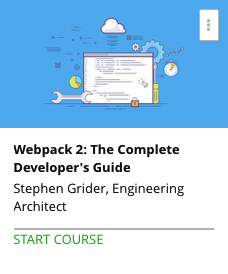

```
Roberto Nogueira  
BSd EE, MSd CE
Solution Integrator Experienced - Certified by Ericsson
```
# Udemy project



**About **

Master `Webpack 2` as you deploy web apps supported by Babel, code splitting, and `ES2015` Modules.

[Homepage](https://udemy.com)

## Topics
```
Section: 1
0 / 2
How to Use This Course
[ ] 1. Start Here! 1:31
[ ] 2. Links to Github Repos 0:00

Section: 2
0 / 12
What Does Webpack Do?
[ ] 3. Why Do We Use Build Tools? 6:38
[ ] 4. Javascript Modules 4:24
[ ] 5. The Purpose of Webpack 4:47
[ ] Quiz 1: Test Your Understanding 0:00
[ ] 6. Webpack in Action 4:54
[ ] 7. Javascript Module Syntax 7:30
[ ] 8. Linking Files with CommonJS 5:16
[ ] 9. Webpack Installation and Configuration 6:31
[ ] 10. More on Webpack Configuration 5:31
[ ] 11. Running Webpack 5:12
[ ] 12. The Bundle.js File 5:59
[ ] 13. Running the App 3:21

Section: 3
0 / 11
Handling Project Assets
[ ] 14. Introduction to Loaders 6:20
[ ] 15. Babel Setup for ES2015 4:08
[ ] 16. Babel Configuration 4:24
[ ] 17. Refactor to ES2015 Modules 3:12
[ ] 18. Handling CSS with Webpack 7:04
[ ] 19. The Style and CSS Loaders 6:13
[ ] 20. Loaders are Tricky! 5:37
[ ] 21. The Extract Text Plugin 6:26
[ ] 22. Handling Images with Webpack 7:18
[ ] 23. Automatic Image Compression 8:48
[ ] 24. Public Paths 4:29

Section: 4
0 / 4
Building for Performance with Webpack
[ ] 25. Introduction to Code Splitting 5:44
[ ] 26. Codesplitting in Practice 4:41
[ ] 27. On Demand Code Loading 5:15
[ ] 28. System Import Calls 6:37

Section: 5
0 / 11
Applying Webpack to a Real Project
[ ] 29. A Real World Project 2:42
[ ] 30. Setting Up Babel 4:27
[ ] 31. Minimum Webpack Config 6:26
[ ] 32. Vendor Asset Caching 4:34
[ ] 33. More on Vendor Caching 5:10
[ ] 34. Refactoring for Vendor Splitting 9:01
[ ] 35. Effect of Code Splitting 6:27
[ ] 36. Troubleshooting Vendor Bundles 9:37
[ ] 37. Chunk Hashing for Cache Busting 6:03
[ ] 38. Cache Busting Wrapup 5:22
[ ] 39. Cleaning Project Files 4:15

Section: 6
0 / 2
Webpack Dev Server
[ ] 40. Introduction to Webpack Dev Server 6:04
[ ] 41. Gotchas with Webpack Dev Server 10:08

Section: 7
0 / 2
React-Specific Topics
[ ] 42. React Router with Codesplitting 7:44
[ ] 43. Plain Routes with React Router Codesplitting 10:44

Section: 8
0 / 5
Webpack-Based Deployment for Static Sites
[ ] 44. Deployment Options 4:22
[ ] 45. Getting Production Ready 7:44
[ ] 46. Deployment with Surge (Easiest!) 3:55
[ ] 47. Deployment with Github Pages 9:02
[ ] 48. Deployment with AWS S3 10:17

Section: 9
0 / 7
Webpack-Based Deployment for Dynamic Sites
[ ] 49. Deployment of Servers 5:02
[ ] 50. Node and Webpack Integration 5:45
[ ] 51. Webpack Middleware in Development 7:28
[ ] 52. Webpack Middleware in Production 10:29
[ ] 53. Deployment to Heroku 8:03
[ ] 54. Deployment to AWS 7:16
[ ] 55. More on AWS Deployment 5:54
```
